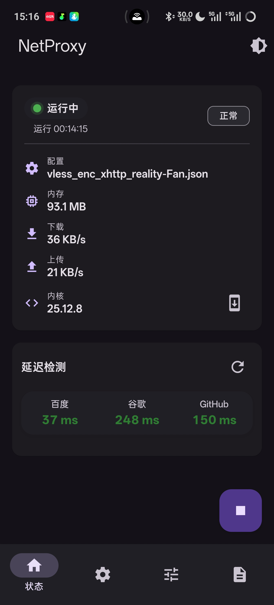
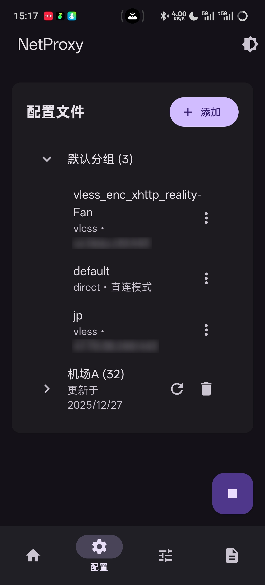
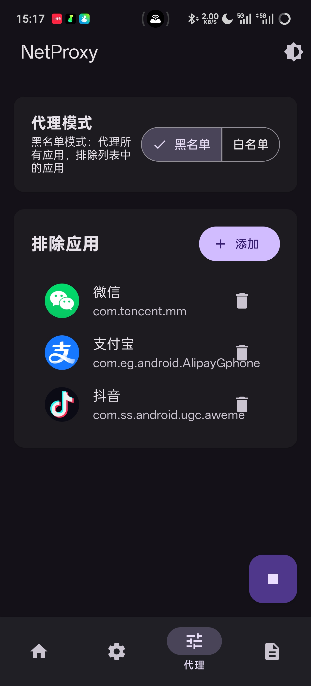

<p align="center">
  
</p>

<h1 align="center">NetProxy</h1>

<p align="center">
  <strong>Android 系统级 Xray 透明代理模块</strong><br>
  支持 TPROXY、UDP、IPv6、分应用代理、订阅管理
</p>

<p align="center">
  <a href="https://github.com/Fanju6/NetProxy-Magisk/releases">
    
  </a>
  <a href="https://github.com/Fanju6/NetProxy-Magisk/releases">
    
  </a>
  
</p>

---

## ✨ 功能特性

| 功能 | 描述 |
|------|------|
| 🖥️ **WebUI 管理** | Material Design 3 现代化界面，支持莫奈取色，功能全面 |
| 🌐 **TPROXY 透明代理** | 支持 TCP + UDP，完整接管系统流量 |
| 📶 **IPv6 支持** | 全面支持 IPv4 和 IPv6 网络 |
| 🎯 **分应用代理** | 黑名单 / 白名单模式，精准控制代理范围 |
| 📦 **订阅管理** | 在线添加、更新订阅，自动解析节点 |
| ⚡ **热切换配置** | 无需重启即可切换节点 |
| 📊 **延迟测试** | 实时测试节点连接状态 |

---

## 🖼️ 界面预览

<div align="center">
  
  
  
</div>

---

## 📥 安装

1. 从 [Releases](https://github.com/Fanju6/NetProxy-Magisk/releases) 下载最新版 ZIP
2. 在 **Magisk / KernelSU / APatch** 中刷入模块
3. 重启设备
4. 打开模块管理器的 WebUI 进行配置

---

## 📁 目录结构

```
/data/adb/modules/netproxy/
├── config/
│   ├── xray/
│   │   ├── confdir/        # 入站、DNS、路由等配置
│   │   └── outbounds/      # 出站节点配置（含订阅分组）
│   ├── proxy.conf          # 代理模式配置
│   └── proxy_apps.list     # 白名单/黑名单应用列表
├── scripts/                # 启动、停止、订阅等脚本
└── bin/xray                # Xray 二进制
```

---

## 🚀 快速开始

### 方式一：节点链接导入（推荐）

在 WebUI 配置页面点击 **添加 → 添加节点**，直接粘贴节点链接：

```
vless://... 或 vmess://... 或 trojan://... 等
```

### 方式二：订阅导入

点击 **添加 → 添加订阅**，输入订阅名称和地址，自动解析全部节点。

### 方式三：手动配置

在 `outbounds` 目录创建 JSON 配置文件，格式示例：

```json
{
  "outbounds": [
    {
      "protocol": "vless",
      "tag": "proxy",
      "settings": { ... }
    },
    { "protocol": "freedom", "tag": "direct" },
    { "protocol": "blackhole", "tag": "block" }
  ]
}
```

---

## ⚙️ 代理模式

| 模式 | 说明 |
|------|------|
| **黑名单** | 列表中的应用**不走**代理 |
| **白名单** | 仅列表中的应用**走**代理 |

在 WebUI 应用页面可以选择模式并管理应用列表。

---

## 📢 交流群组

<p align="center">
  <a href="https://t.me/NetProxy_Magisk">
    
  </a>
</p>

---

## 🤝 贡献

欢迎参与项目！

- 🐛 提交 Issue 反馈 BUG
- 💡 提出功能建议
- 🔧 提交 Pull Request
- ⭐ Star 支持项目！

---

## 📜 许可证

[GPL-3.0 License](LICENSE)
